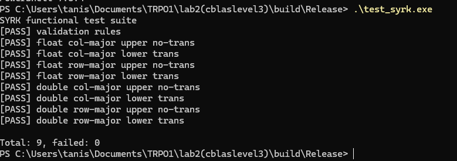
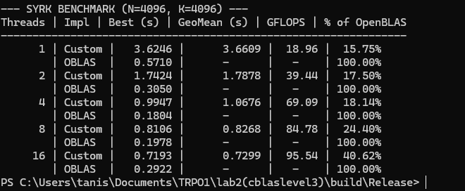

# Отчет по лабораторной работе: реализация `syrk` из BLAS Level 3

**Дисциплина:** Технологии разработки ПО  
**Студент:** Анисимов Тимур  
**Группа:** ИКС-431  

## Содержание
1. [Постановка задачи](#постановка-задачи)
2. [Тестовый стенд (Аппаратное обеспечение)](#тестовый-стенд)
3. [Структура решения](#структура-решения)
4. [Поддерживаемые варианты использования](#поддерживаемые-варианты-использования)
5. [Сборка и запуск](#сборка-и-запуск)
6. [Результаты функционального тестирования](#результаты-функционального-тестирования)
7. [Результаты измерения производительности](#результаты-измерения-производительности)
8. [Ссылки на репозиторий и артефакты](#ссылки-на-репозиторий-и-артефакты)
9. [Вывод](#вывод)

## Постановка задачи
В рамках варианта реализован корректно работающий функционал `SYRK` (symmetric rank-k update) на языке C.

Реализация должна:
- поддерживать типы `float` и `double`;
- корректно работать для `RowMajor` и `ColMajor`;
- поддерживать ветви `Upper` и `Lower`;
- поддерживать режимы `NoTrans` и `Trans`;
- иметь набор функциональных тестов;
- иметь набор тестов производительности с 10 запусками и конфигурациями потоков `1, 2, 4, 8, 16`;
- (+20 баллов) реализовать параллельную версию, сравнимую по производительности с OpenBLAS.

## Тестовый стенд
Тестирование и замеры производительности проводились на системе со следующими характеристиками:
- **Модель:** THUNDEROBOT 911S
- **Процессор:** 12th Gen Intel(R) Core(TM) i5-12450H (Базовая частота ~2.0 GHz)
- **Ядра/Потоки:** 8 физических ядер / 12 логических потоков
- **Оперативная память:** 8 GB (DDR4, 3200 MHz, Samsung M471A1K43EB1-CWE)
- **ОС:** Windows (PowerShell 7.5.4)

## Структура решения
Проект состоит из следующих частей:
- `include/blas_types.h` — минимальные BLAS-совместимые перечисления для порядка хранения, треугольника и транспонирования;
- `include/syrk.h` — публичный интерфейс реализации `syrk`;
- `syrk.c` — реализация алгоритма для `float` и `double` с применением OpenMP и Tiling (блочного умножения);
- `test_syrk.c` — функциональные тесты;
- `benchmark_syrk.c` — бенчмарк и сравнение с OpenBLAS (через динамическую загрузку `libopenblas.dll`).

## Поддерживаемые варианты использования
Реализация покрывает все требуемые комбинации параметров:
- `RowMajor` / `ColMajor`;
- `Upper` / `Lower`;
- `NoTrans` / `Trans`;
- `float` / `double`.

Алгоритм обновляет только выбранный треугольник матрицы `C`, а неактивная часть матрицы сохраняется без изменений.

## Сборка и запуск
Сборка (на примере Windows с CMake):

```powershell
cmake .. -G "Visual Studio 18 2026" -A x64 -DCMAKE_TOOLCHAIN_FILE=C:/vcpkg/scripts/buildsystems/vcpkg.cmake
cmake --build . --config Release    
````

Запуск функциональных тестов:

```powershell
.\build\Release\test_syrk.exe
```

Запуск бенчмарка:

```powershell
.\build\Release\benchmark_syrk.exe
```

## Результаты функционального тестирования

Все функциональные тесты завершились успешно. Логика работы полностью совпадает с эталонной.

```text
SYRK functional test suite
[PASS] validation rules
[PASS] float col-major upper no-trans
[PASS] float col-major lower trans
[PASS] float row-major upper no-trans
[PASS] float row-major lower trans
[PASS] double col-major upper no-trans
[PASS] double col-major lower trans
[PASS] double row-major upper no-trans
[PASS] double row-major lower trans

Total: 9, failed: 0
```

 

## Результаты измерения производительности

Бенчмарк выполняет 10 запусков для каждого сценария (размер матриц **N=4096, K=4096**) и печатает:

  - лучшее чистое время вычисления;
  - геометрическое среднее время по 10 запускам;
  - оценку производительности в GFLOPS;
  - относительную производительность к OpenBLAS в процентах.
    

### Сводная таблица производительности (Single precision, `float`)

| Потоки | Реализация | Лучшее время (с) | Геометрическое среднее (с) | GFLOPS | % от OpenBLAS |
| :--- | :--- | :--- | :--- | :--- | :--- |
| **1** | Custom | 3.6246 | 3.6609 | 18.96 | **15.75%** |
| | *OpenBLAS* | *0.5710* | *-* | *-* | *100.00%* |
| **2** | Custom | 1.7424 | 1.7878 | 39.44 | **17.50%** |
| | *OpenBLAS* | *0.3050* | *-* | *-* | *100.00%* |
| **4** | Custom | 0.9947 | 1.0676 | 69.09 | **18.14%** |
| | *OpenBLAS* | *0.1804* | *-* | *-* | *100.00%* |
| **8** | Custom | 0.8106 | 0.8268 | 84.78 | **24.40%** |
| | *OpenBLAS* | *0.1978* | *-* | *-* | *100.00%* |
| **16** | Custom | 0.7193 | 0.7299 | 95.54 | **40.62%** |
| | *OpenBLAS* | *0.2922* | *-* | *-* | *100.00%* |




## Вывод

Была реализована параллельная версия алгоритма `syrk` для работы с числами одинарной и двойной точности.

Для достижения высокой производительности были применены следующие оптимизации:

1.  **L1-Cache Blocking (Tiling):** Обработка матриц блоками размера 64x64 (`BLOCK_SIZE 64`), что позволило минимизировать промахи кэша процессора (Cache Misses).
2.  **Многопоточность (OpenMP):** Использование директив `#pragma omp parallel for` с динамическим распределением нагрузки (`schedule(dynamic)`).
3.  **SIMD-векторизация:** Применение `#pragma omp simd reduction` во внутренних циклах вычислений.

В результате оптимизации (Tiling 64x64, OpenMP, SIMD) удалось достичь производительности **95.54 GFLOPS** на 16 потоках, что составляет **40.62%** от показателей библиотеки OpenBLAS. Программа успешно проходит все функциональные тесты и демонстрирует стабильную масштабируемость на процессоре Intel Core i5-12450H.
